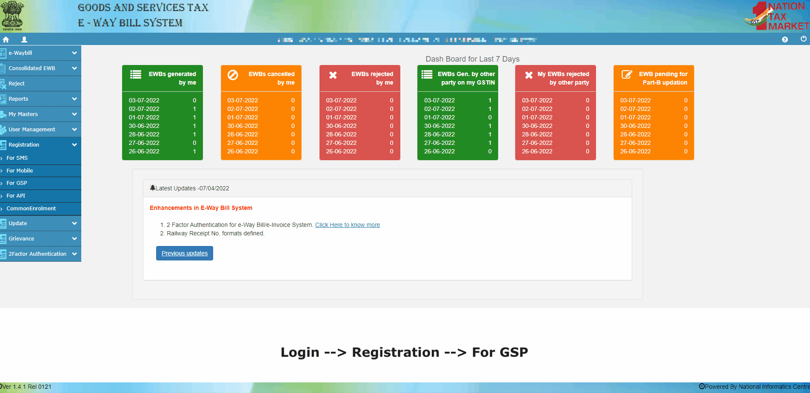

# Setting-Up API
## GSP Credentials
Setup Credentials for e-Waybill or e-Invoice

New GSP User will be required if you want to generate e-Waybill or e-Invoice using APIs.  
**The following steps will help you create a new user for GSP.**

1. Login to the e-Waybill portal using your existing credentials.
2. Go to Registration --> For GSP and authenticate yourself with OTP.
3. Add New User. Choose GSP Name as **Adaequare Info Private Limited**.
4. Enter the appropriate Username and Password and add the user.

**Are the credentials for e-Waybill and e-Invoice the same?**  
**Yes**, e-Waybill or e-Invoice Portal have the same credentials. Updating your password on any portal will update it on another portal also.

**Is it necessary to create GSP Login to make API Access?**  
**Absolutely**, in a way, you are authorizing GSP to create/upload e-Waybill and e-Invoice transactions on your account. You shall not be able to access APIs if credentials are for different GSP / you are using personal login credentials.

## Adding GSP 
After creating new user for GSP ,same has to be added in ERPNext.
For adding GSP Credential  
**Go to GST Settings --> Select Credentials Tab --> Add new user with same Username and Password** 

## e-Waybill Settings

- **Enable e-Waybill Features**  
If e-waybill is applicable to enable the e-Waybill Features.  

- **Enable e-Waybill Generation from Delivery Note**:  
Do you want to generate an e-Waybill from the delivery note? Do you transfer goods for Job Work or to your different warehouse? You should enable e-Waybill generation from Delivery Note if you use these features.

::: tip
You should ideally generate an e-Waybill from the sales invoice. e-Waybill generation from delivery notes should be restricted only to the movement of goods without an Invoice (Say, for Job Work or Transfer of goods to different warehouses)
:::

- **Invoice Value Threshold for e-Waybill Generation**  
It's set to 50,000 by default, but you can change it as per applicable laws or ensure tighter internal controls. Applicability of e-Waybill for Sales Invoice is checked based on this setting.

### Additional API-Specific Settings

- **Automatically Generate e-Waybill on Invoice Submission**  
e-Waybill generation will be attempted if all required fields are present and e-Waybill is applicable.

::: warning
e-Waybill applicability is checked based on the threshold limit set above. Also, at least one item with HSN of **goods** must be present.
:::

- **Fetch e-Waybill Data After Generation**  
On the generation of e-Waybill, complete data of e-Waybill (as per NIC Portal) is not available. However, this may be necessary to generate the e-Waybill Print Format as per the e-Waybill Portal. *Additional API request is required to fetch the e-Waybill data.* If enabled, it shall be updated in your logs.

- **Attach e-Waybill Print After Generation**  
e-Waybill print will be attached to the invoice automatically on the generation of the e-Waybill (after fetching the data). It can be used for emails or records.

## e-Invoice Settings
::: warning
You need to first enable API to access e-Invoice Settings
:::

- **Enable e-Invoicing**  
Enable e-Invoicing if it is applicable to you.

- **Automatically Generate e-Invoice on Invoice Submission**  
e-Invoice will be automatically generated, if applicable, on submission of Sales Invoice.

    > e-Invoice is automatically generated for all invoices except for supplies to Unregistered Person or Non-GST Supplies.

- **e-Invoice Applicable From**  
e-Invoices will only be generated for invoice generated after this date. You can pre-configure this if its going to be applicable at a later date.

