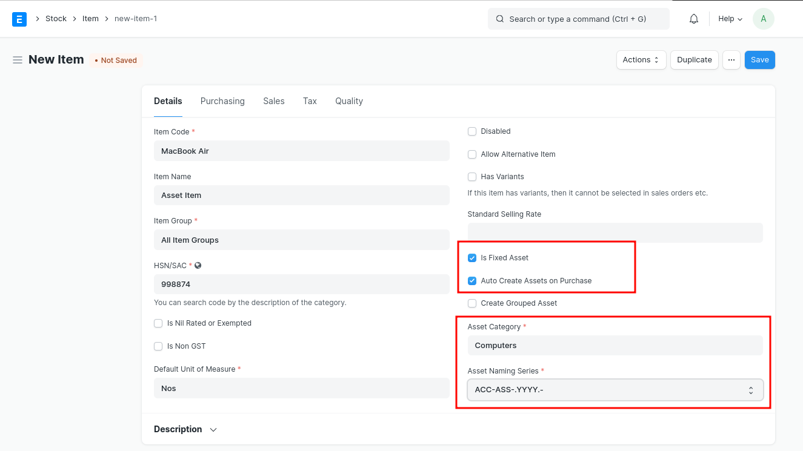
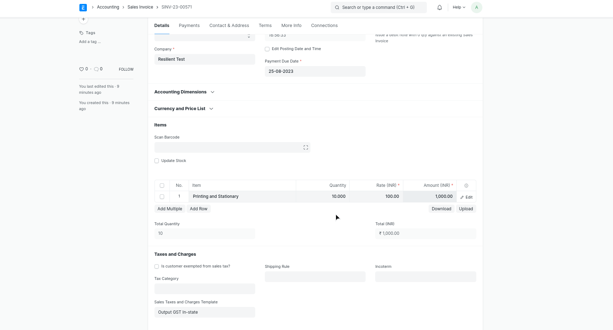
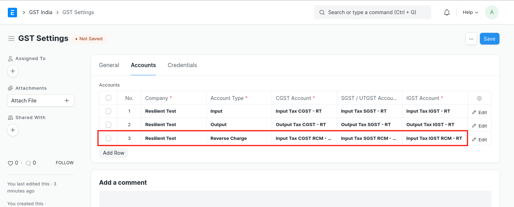
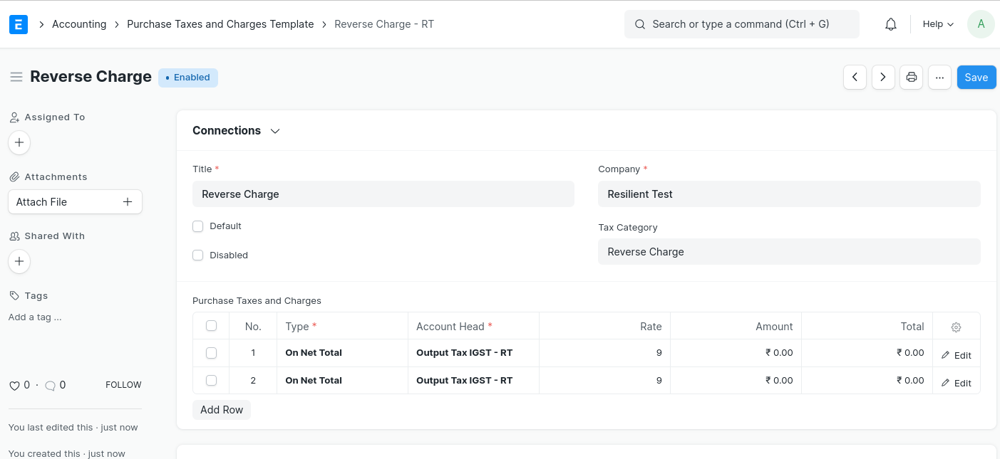

# GST Purchase Transactions
GST Purchase Transactions involves the aquisition of goods or services by a business from the supplier. Setup GSTIN of your supplier and the required Tax Templates to the transactions for making GST Ready Invoices!

## Purchase Invoice
1. Select the Supplier and Item.
2. Add Supplier Invoice Number and Supplier Invoice Date.(optional)
2. Check if the GSTIN of your Company and Supplier have been correctly set.
3. Check if the HSN Number has been set correctly in the Item.
4. Select  **In State GST** or **Out of State GST** as a tax template.
5. Save and Submit the Invoice.

## GST Asset Purchase
For purchasing a new asset:
1. Create an Asset Category.
2. Create a related Item with 'Is Fixed Asset' enabled and Asset Category for the item.
3. You can also enable the option 'Auto create Asset on Purchase' to create assets automatically.(Optional)

4. Then, Follow a Purchase Cycle (Purchase Order, Purchase Invoice and Purchase Receipt etc.) for purchasing an asset.
5. Enter the Asset Location in Items table of the Purchase Receipt or Purchase Invoice through which you are receving the item.
6. On submission of Purchase Receipt, based on the auto creatio n checkbox, Asset will be created automatically.

## GST Expense 
When a business makes purchases that are subject to GST, the GST amount paid is considered an expense. This expense is accounted for on the business's financial statements.

## Reverse Charge
Setting up reverse charge and posting reverse charge purchase invoices.

- ### Add reverse charge accounts in GST Settings

Add reverse charge accounts for GST as shown in the image below and select the Account Type as "Reverse Charge" as shown in the image below. Instead of separate reverse charge account the Output GST tax account used for sales can also be marked as reverse charge account

- ### Making purchase invoices liable to reverse charge

To make purchase invoices liable to reverse charge invoices, follow the steps:

* Select Supplier and add items to the invoice as usual
* Enable "Is Reverse Charge" in Purchase Invoice
* If GST paid is eligible for input tax credit, in "Eligibility for ITC" select "ITC on Reverse Charge"
* "Add" taxes using the regular Input Tax account heads

* "Deduct" the same amount of taxes using the reverse charge accounts so that the net GST payable by the supplier is 0

* Save and Submit

In order to avoid manual selection of accounts and automate this process you can select already generated default Tax Template for Reverse Charge In-State as well Out-State Or to create your own please follow the below steps:

* Create Tax Category for reverse charge

* Update tax category in the relevant supplier masters

* Create Purchase Taxes and Charges template for reverse charge

* Once this configuration is done, on selection of supplier appropriate Purchase Taxes and Charges Template will be applied
