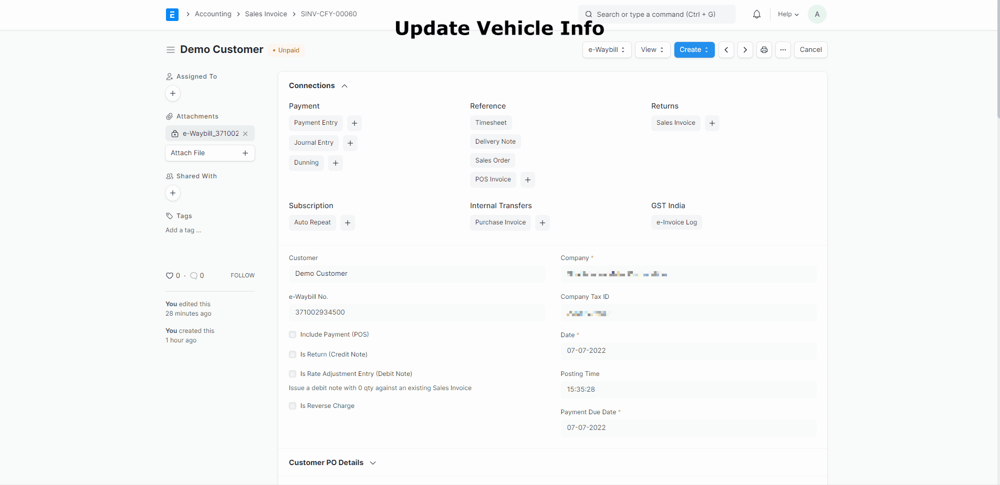
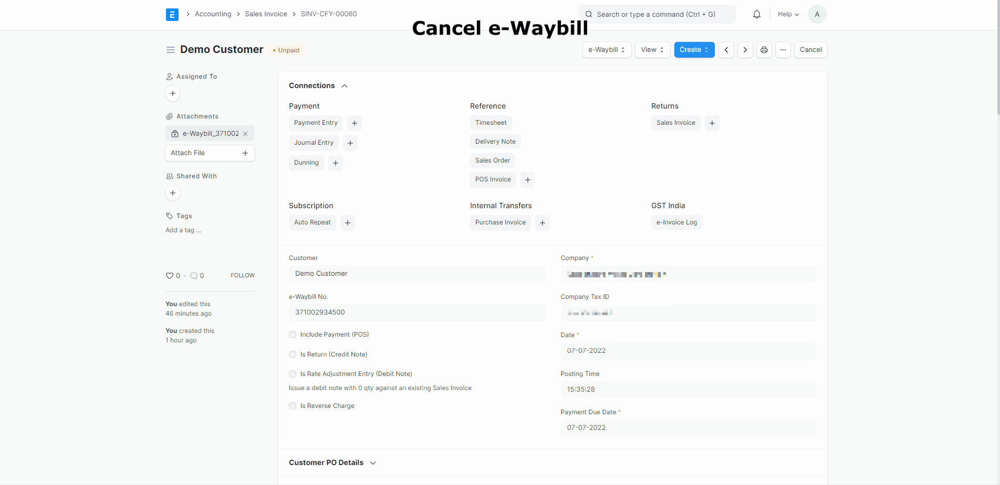
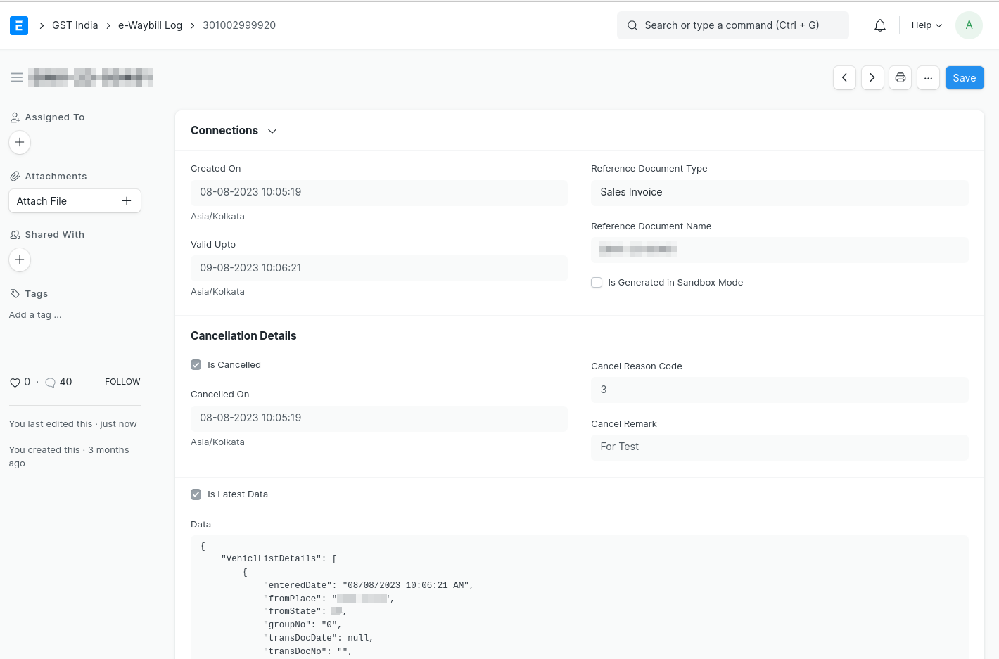
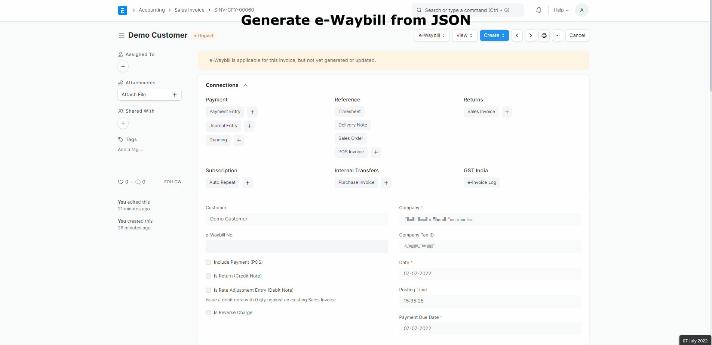

# e-Waybill
e-Waybill is an electronic waybill required to be generated on [e-Waybill Portal](https://ewaybillgst.gov.in/) for the movement of goods. India Compliance offers multiple ways to manage your e-Waybill compliance.

You can generate the e-Waybill using the bulk generation facility or the APIs.

## Prerequisites
- [GSP credentials in ERPNext](gst_settings#gsp-credentials)
- [India Compliance Account](../getting-started/india_compliance_account#account-creation)
- API should be enabled under GST Settings.
- [e-Waybill Configration](gst_settings#e-waybill-settings)

## e-Waybill Generation Using API
 
- On submitting the sales invoice, e-Waybill shall be automatically generated (*if enabled in settings*).
- You can manually trigger the generation of e-Waybill for Delivery Note or where all fields were not present (on submit).

**Go to the e-Waybill menu --> Generate dialog --> Update fields and click Generate.**

#### How would I know if only Part A of the e-Waybill will be generated?

Dialog for Generate e-Waybill fields have separate sections for Part A and Part B. Also, the Primary Action button will denote if only Part A can be generated.

#### How to auto calculate the distance for e-Waybill?

If the distance is set to zero (0), e-Waybill Portal will suggest the distance between postal codes. We shall update it to your document where e-Waybill is generated using the APIs.

*In some exceptional circumstances, where the distance between postal codes is unavailable with the e-Waybill database, you shall receive a prompt. Generate e-Waybill again after entering the distance as per your estimate.*  

## Update Transporter Details

::: warning
Updating or cancelling e-Waybill is possible only within the validity period. These options will be visible only if you have generated the e-Waybill using API and the validity to do so is not expired.
:::

Use this feature to update the GSTIN of the transporter to your e-Waybill.  

**From e-Waybill menu --> Select Update Transporter --> Update appropriate information and click update.**

## Update Vehicle Information
Use this feature to update the vehicle information (say, vehicle number) to your e-Waybill. 

**From e-Waybill menu --> Select Update Vehicle Info --> Update information in dialog and click update.**

> There is a checkbox in the dialogs above for `Update e-Waybill Print/Data`. If you check this, we shall update the attachments of e-Waybill or Data concerning e-Waybill as per your preference from GST settings for e-Waybill. If `Attach e-Waybill Print After Generation` is enabled from GST Settings, new attachments will replace old attachments.
    

## Extend e-Waybill Validity
The validity of e-Waybill can be extended between 8 hours before expiry time and 8 hours after expiry time.
From the e-Waybill menu, Click on "Extend Validity". In the dialog box, enter the requiered details and specify the reason for the extentions and click Extend to extend the validity of the e-Waybill.

1. click on "Extend Validity"
2. Update the required details in the dialog box.

## Print e-Waybill
You can use this to print an e-Waybill if you prefer not to have attachments. It works similar to printing any other document in ERPNext. It will redirect you to the respective e-Waybill log print and fetch the latest e-Waybill data (from NIC Portal) for printing if it's not available.

## Attach e-Waybill
It is a manual trigger to attach an e-Waybill to a Sales Invoice. A new attachment will replace the old attachment if present.

## Cancel e-Waybill
If within validity, you shall be allowed to cancel the e-Waybill.  
From the e-Waybill menu, Cancel e-Waybill. In the cancellation dialog, Specify the reason for cancel and click cancel to cancel the e-Waybill.
>*While you cancel the e-Waybill, the attachment of the old e-Waybill, shall be removed.*
    

## e-Waybill Logs
In this DocType, e-Waybill history is maintained. It will be created in background once you generate an e-Waybill using the APIs. Any further updates to e-Waybill are added here as a comment.

Updated Log

## Bulk e-Waybill Generation

e-Waybills can be generated in bulk by two ways. 

1. Generate e-Waybill JSON
2. Enqueue Bulk e-Waybill Generation

**1. Generate e-Waybill JSON and Upload it to GSP Portal**
- Select the documents from the Sales Invoice List for which you want to generate an e-Waybill JSON.
- Click Actions --> Generate e-Waybill JSON
- Login to your e-Waybill Account --> Select Generate Bulk e-Waybill --> Choose the JSON file and upload it --> Click Generate.
- e-Waybill shall be generated --> Update the e-Waybill number in your Sales Invoice / Delivery Note.

<!-- ToDo: Update GIF from Portal -->

**2. Enqueue Bulk e-Waybill Generation**
- Update the documents with Transporter details for which you want to generate e-Waybills in bulk.
- Select the documents from list view, and from actions click to option "Enqueue Bulk e-Waybill Generation".
- e-Waybills will be enqueued for the selected documents.

## e-Waybill JSON Genration

**Steps to generate e-Waybill JSON for single document**

- Submit the relevant document(say Sales Invoice).
- If e-Waybill is applicable for the current document, you shall see the e-Waybill menu --> Select Generate.
- Generate e-Waybill dialog box shall appear.
- Update the transport fields and Download JSON.
- Login to your e-Waybill Account --> Select Generate Bulk e-Waybill --> Choose the JSON file and upload it --> Click Generate.
- e-Waybill shall be generated --> Update the e-Waybill number in your Sales Invoice / Delivery Note.

::: warning
You shall not be able to update transport fields while you download e-Waybill JSON from the Sales Invoice List.
:::
