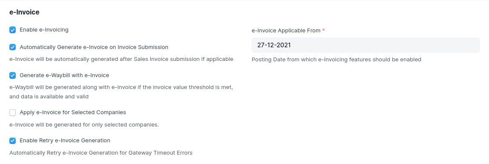
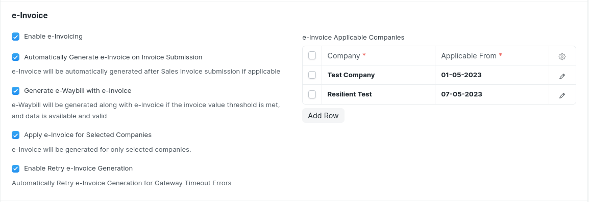

# Setting-Up API
## GSP Credentials
Setup Credentials for e-Waybill or e-Invoice on GSP Portal

You must need to create a new GSP User to generate and avail the features of e-Waybill or e-Invoice using APIs.  
**The following steps will help you create a new user for GSP.**

1. Login to the e-Waybill portal using your existing credentials.
2. Go to Registration --> For GSP and authenticate yourself with OTP.
3. Add New User. Choose GSP Name as **Adaequare Info Private Limited**.
4. Enter the appropriate Username and Password and add the user.


**Are the credentials for e-Waybill and e-Invoice the same?**  
**Yes**, Portal shares the same credentials for e-Waybill or e-Invoice. Updating your password on any portal will also update it on other portal.

**Is it necessary to create GSP Login to make API Access?**
**Absolutely**, in a way, you are authorizing GSP to create/upload e-Waybill and e-Invoice transactions on your account. You shall not be able to access APIs if credentials are different for GSP or you are using personal login credentials.

## Adding GSP 
In next step, same GSP settings has to be added in ERPNext.
To add GSP credentials to the ERPNext:
```
**Go to GST Settings --> Select Credentials Tab --> Add new user with same Username and Password** 
```


## e-Waybill Settings

- **Enable e-Waybill Features**  
Enable this setting to avail e-Waybill Features like generating e-Waybill, Update Transporter & Vehicle Information, and extend the validity of e-Waybill.

- **Enable e-Waybill Generation from Delivery Note**:  
Do you want to generate an e-Waybill from the delivery note? Do you want to transfer goods for Job Work or to your different warehouse? Enable "e-Waybill generation from Delivery Note" to start generating e-Waybills from Delivery Note.

::: tip
You should ideally generate an e-Waybill from the sales invoice. e-Waybill generation from delivery notes should be restricted only to the movement of goods without an Invoice (Say, for Job Work or Transfer of goods to different warehouses)
:::

- **Enable e-Waybill Generation from Purchase Invoice**
Enable this setting to generate e-Waybill from Purchase Invoice. Businesses are generally required togenerate e-Waybills for Purchases involving the movement of goods to ensure compliance, transparency and accurate taxation.


- **Invoice Value Threshold for e-Waybill Generation**  
As per the CGST Rules, the limit is Rs.50,000 which is set by default. But it may very state wise so, you can configure it as per applicable laws or ensure tighter internal controls. Applicability of e-Waybill for Sales Invoice is checked based on this setting.


### Additional API-Specific Settings

- **Automatically Generate e-Waybill on Invoice Submission**  
e-Waybill generation will be attempted if all required fields are present and e-Waybill is applicable.

::: warning
e-Waybill applicability is checked based on the threshold limit set above. Also, at least one item with HSN of **goods** must be present.
:::

- **Fetch e-Waybill Data After Generation**  
On the generation of e-Waybill, complete data of e-Waybill (as per NIC Portal) is not available. However, this may be necessary to generate the e-Waybill Print Format as per the e-Waybill Portal. *Additional API request is required to fetch the e-Waybill data.* If enabled, it shall be updated in your logs.

- **Attach e-Waybill Print After Generation**  
On enabling this option, e-Waybill print will be attached to the invoice automatically on the generation of the e-Waybill (after fetching the data). It can be used for emails or records.


## e-Invoice Settings
::: warning
You need to first enable API to access e-Invoice Settings
:::

- **Enable e-Invoicing**  
Enable e-Invoicing if it is applicable to you.

- **Automatically Generate e-Invoice on Invoice Submission**  
If this settings is enabled, e-Invoice will automatically be generated on submission of Sales Invoice.

- **Generate e-Waybill with e-Invoice**
e-Waybill will be generated along with e-Invoice if the invoice value threshold is met, and data is available and valid.

    > e-Invoice is automatically generated for all invoices except for supplies to Unregistered Person or Non-GST Supplies.

- **e-Invoice Applicable From**  
e-Invoices will only be generated for invoices generated after this date. You can pre-configure this if its going to be applicable at a later date. This date will be applicable only if **Apply e-Invoice for Selected Companies** option is disabled.



- **Apply e-Invoice for Selected Companies**
This setting will allow you to configure e-Invoicing for Selected Companies only.

- **e-Invoice Applicable Companies**
Set **Applicable From** date for each Company. Validation checks will be performed based on this setting.

- **Enable Retry e-Invoice Generation**
If this setting is enabled, e-Invoice generation will automatically retry e-Invoice generation in case of Gateway Timout Errors.


